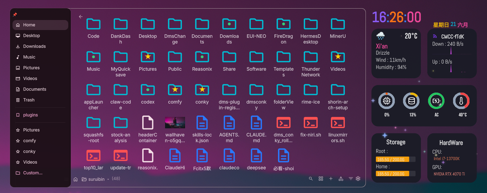
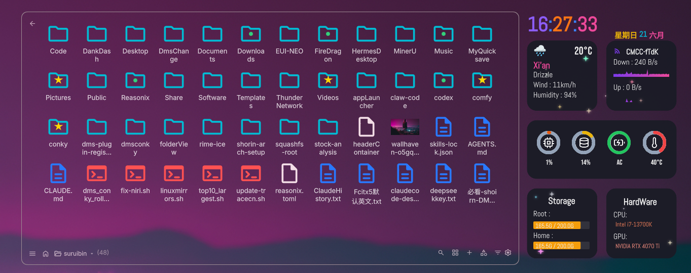
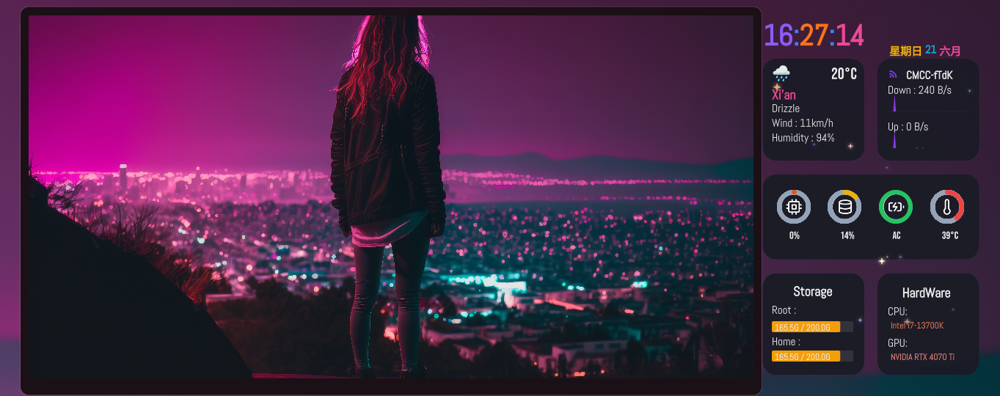

# DMS File Manager

文件夹查看器小部件，可在屏幕上显示和管理文件与目录。

## 截图





## 安装

```bash
git clone https://github.com/suruibin/dms-conky ~/.config/DankMaterialShell/plugins/conky
```
复制dmsfilemanager到  ~/.config/DankMaterialShell/plugins/

## 功能

- **多语言切换：** 预设多语言切换。
- **目录切换：** 在预定义系统文件夹（桌面、下载、主目录等）或任意自定义目录路径间切换。
- **多种布局：** 在网格视图、列表视图和紧凑视图之间切换（在设置中配置；紧凑视图会根据小部件宽度自动折列）。
- **快速操作：** 搜索/筛选项目、排序文件（按名称、日期、大小、类型），或从小部件标题栏直接创建项目。
- **可调节尺寸：** Ctrl + 鼠标滚里滑动 调整文件大小
- **文件操作：** 创建项目（文件夹/文档）、重命名、复制路径、移到回收站以及系统剪贴板文件复制。
- **侧边栏操作：** 可以将侧边栏固定 
- **多选：** 使用 `Ctrl` 和 `Shift` 修饰键多选项目以执行批量操作。
- **文件预览：** 选中文件 按Tab键 预览普通文件。
- **图片预览：** 选中图片 按Tab键 图片预览 且可以设置幻灯片模式播放。
- **图片预览：** 选中视频 按Tab键 播放播放。

## 用法

| 操作 | 效果 |
|---|---|
| **左键单击文件夹标题** | 打开目录选择下拉菜单（桌面、下载、回收站、主目录、自定义等） |
| **左键单击 `+` 图标** | 打开创建下拉菜单（新建文件夹、新建文档） |
| **左键单击排序图标** | 打开排序选项下拉菜单（名称、日期、大小、类型） |
| **左键单击搜索图标** | 展开/收起搜索输入框，按名称即时筛选文件 |
| **左键单击文件/文件夹** | 选中单个项目 |
| **左键单击已选项目的标签** | 就地重命名项目（内联编辑） |
| **Ctrl + 左键单击** | 切换多个项目的选中状态 |
| **Shift + 左键单击** | 选中连续范围的项目 |
| **双击项目** | 打开文件夹或使用系统默认应用打开文件 |
| **中键单击项目** | 打开上下文菜单（打开、浮窗显示、复制、复制路径、重命名、移到回收站） |
| **左键单击空白区域** | 取消当前选中 |
| **中键单击空白区域** | 将文件、文件夹或剪贴板截图粘贴到当前文件夹 |


## 依赖

- `python3` - 仅用于处理高级剪贴板粘贴操作（例如从剪贴板粘贴图片/截图）。
- `wl-clipboard` - 用于 `wl-copy`（将非图片文件复制到剪贴板）和 `wl-paste`（粘贴时读取剪贴板）。
- `glib2`（或 `gio`） - 用于将文件正常移到回收站（`gio trash`）。

## 许可证

GPL-3.0

## 待办 / 路线图
